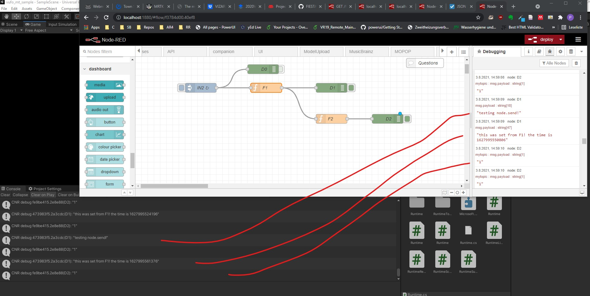
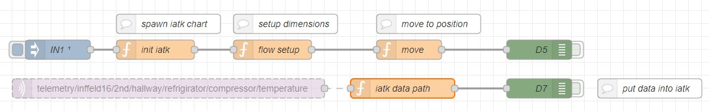
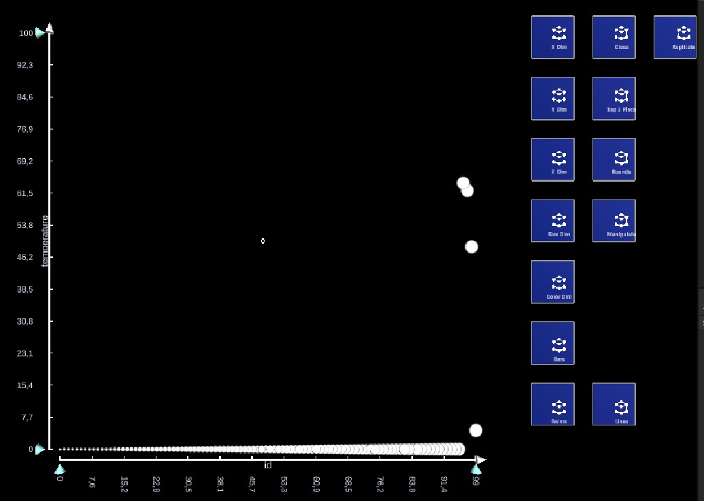

## Changelog / Updates

### 20210806 Local PubSub
RagRug offers know the possibility to apply the well known MQTT public-subscribe scheme to the local instance.
We can know register callbacks to topics without an topic subscription, which will activate the callbacks only local publish.
Once also subscribed to a topic, callbacks are also activate by remote messages. Using the `MQTT.Publish` we can decide
if the message is local or not. We keep compatibility by following the `topic, payload` signature, which additionally
allows to do easy re-routing or bouncing without any changes.

### 20210804 CNR - Clientside NodeRed

### 20210729 IATK Replicator
[Github](https://github.com/philfleck/IATK/tree/icg_fleck_replicator)

