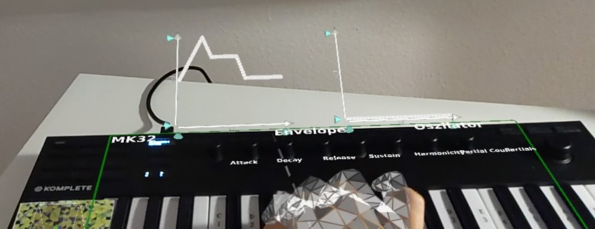
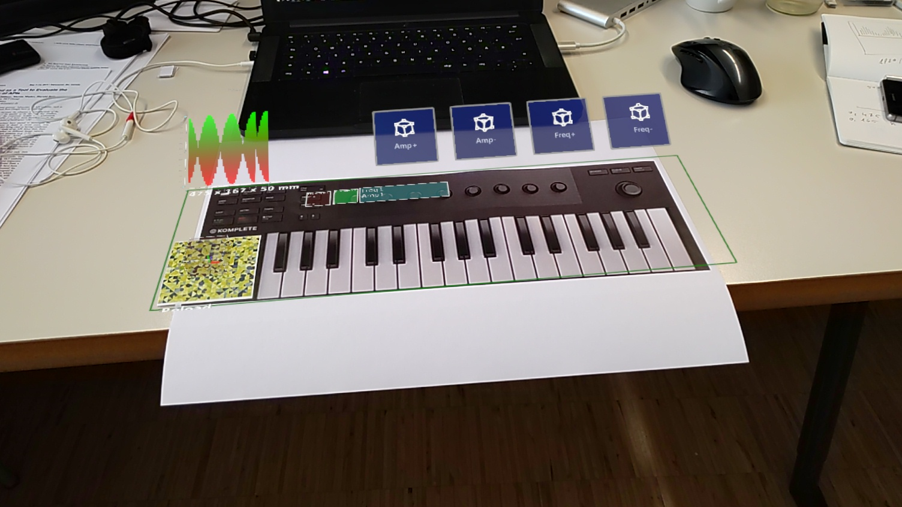

# Building a device registered-control interface eg MIDI Control
The easiest way to register the control interface to the physical device is by using vuforia as shown in the example above.

TODO: add here which field to populate for auto tracking

After setting up vuforia, we can add the `controlenv` section to the device within the location where we tell from where the html
control interface should be loaded. It does not have to be html, but it serves as an entry point for `js` implementation.

We can place 3D objects realtive to the marker (the device) in metric world units or we can plac html elemetns in pixel units
within the dom. Therefore we need to map the pixels per world unit, since we render a 2d Dom with a physical size and a certain
rendering resolution. (([see Fleck2020](https://dl.acm.org/doi/abs/10.1145/3424616.3424691) ))

By default we create HTML Dom with an resolution 1920px x 1080px where the default `ppw = 0.35` this is set to render nicely within 
the hololens. Based on this info we can calculate the pixelsize the following:

```
The board is 475 x 167 x 50 mm

p[px] / ppw = m[m]
1920px / 0,35m = 5485 // default 1920px @ 35cm width
X / 0,475m = 5485 => 0,475 * 5485 = 2605px
Y / 0,167 = 5485 => 0,167 * 5485 = 915px

By keeping the resolution we need to render at 2605px to get a
physical size of 47,5cm and height of 915px to result in 16,7cm.
```

The adjusted the following `ondevicecontrols`:

```json
"ondevicecontrols": {
    "controlurl": "http://10.0.0.2:9999/midisim.html",
    "width": 1,
    "height": 1,
    "pixelw": 2605,
    "pixelh": 915
  }
```

Once that is in place we can for example draw a boarder around the device to frame it:

```css
.mididevice {
    top: 1px;
    left: 1px;
    width:95%;
    height:95%;
    border: solid green 8px;
}
```

```html
<div id="mididevice" class="mididevice"> 475 x 167 x 50 mm </div>
```

An offset for degenerated cases where tthe marker is placed off-center can be set e.g. using js:

```javascript
// Get corresponding device
MI.go = importNamespace("UnityEngine").GameObject.Find(deviceName + "control");
// move the ui interface 20cm to the right and 2cm to the top, when looking flat on the marker
RT.Unity.SetLocalPose(MI.go, [0.2, 0.02, 0], [0.707, 0, 0, 0.707], null);
```
Note: If we mount the marker on the left side of the device, the center of the markerui will be n the center of the marker. Moving it to the right will move the ui towards the center of the device.

As usual we can add buttons, visualizations and other content. Putting it all together we get something like this:



[Video](https://files.icg.tugraz.at/f/0abdd85019b2407c80fe/)

Warning: Replace with image of the real device!