#  RagRug Documentation

## Overview

### Features

## Hub (Orchestated Backend)
The hub consists of a number of loosely connected component orchestrated with docker and connected via a docker-network.
Components are usually based on well known commodity software, but can also be proprietary implementations. Furthermore, each component stands on his own and is responsible for its functionality with no or little side-dependencies.

### Hub API
#### Rest
```
GET /getfile?name=myfilename => will server a file from /data/outputs
```
```
GET /getfile2?name=myfilename => will server a file from /data/uploads
```
### Components
#### NodeRed
#### MQTT Broker
#### CouchDb
The docker container will start on port `5984` by default.

- Fauxon web interface: http://ip:5984/_utils
- Direct link to file: http://ip:5984/_utils/#database/{databasename}/{documentid}

#### InfluxDB
#### PostgresDB
#### Grafana
#### Http Server
### Docker Orchestration
### Setup

## Client / ARClient
### C# Framework
### Js Framework
### IATK
[IATK Repo](https://github.com/MaximeCordeil/IATK)

[philfleck's fork](https://github.com/philfleck/IATK)

[IATK Replicator Docu](https://github.com/philfleck/IATK/blob/icg_fleck_realtime_datasource_and_replicator/README.md#iatk-replicator)

#### IATK Replicator within RagRug

Default:
[gimmick:yuml]([MQTT-IN]->[RTDS.Add]-<>[IATK Vis]<-[Setup Vis],[IATK Vis]-[note: Non replicated IATK{bg:wheat}]-[RTDS.Add])

Replicated:
<!--
[gimmick:yuml]([MQTT-IN]->[RTDS.Add]-<>[IATK Vis]<-[Setup Vis],[Replicator]<>-Type/Name[RTDS.Add],[Replicator]<>-JSON[IATK Vis],[Replicator]<>-Topic/Payload Parsing[MQTT-IN],[Replicator]<>-Updates over JSON[R IATK Vis],[Replicator]<>-Type/Name[R RTDS.Add],[MQTT-IN]->[R RTDS.Add],[R RTDS.Add]-<>[R IATK Vis],[R IATK Vis]-[note: Replicas{bg:wheat}]-[R RTDS.Add],[IATK Vis]-[note: Replication Source{bg:wheat}]-[RTDS.Add])
-->

The Replicator is based on three major hook which nee to be populated. 

- IATK Serialization on change will report a payload representing the new state once changes appear. Usually all changes with an visual change are followed by an update. This is the triggerpoint.
- Datasource changes like a new dimension is added
- The source of an new dimension like an MQTT data stream

To replicate an visualization, we call `repl.AddVisToReplicate(vis.uid, vis, false)` on the Replicator and pass on the visualization. The replicator will trigger a Serialization and distribute the payload. In that manner the Datasource definition (Type, Dimensions, ...) are also added `repl.AddDataSourceDef(chartData.vis.uid, replMqttTopic, uniqueFieldName, replFieldname)` and distributed. Since we dont know the data, we need to pass the right diemension and the fieldname within the payload to correctly replicate the visualization and its data.In RagRug we usually subscribe and publish to replications on  `rr/vis/replication/visid/view` for the visualization and `rr/vis/replication/visid/ds`. Due to theasynchronous and spontaneous nature, we separate all updates channels to allow for invidual updates of DataSources, Dimensions and Visualizations. 

To receive replications we just listen to `rr/vis/replication/#` where every visualization arrives with its own id. The Replicator keeps track of its primes and the received replicas, sinc there is no prime user but a prime visualization.


### MQTT Client
### MRTK

```JavaScript
// setting up a 3D button from js
var deviceButton = RT.MRTK.SpawnButton("UIBTN-RegDevice", "Device", "Device", false, Main_RegisterDevice);
MAIN.buttons.push(deviceButton);
RT.Unity.SetParent(deviceButton.go, MAIN.palmHandMenuGo);
RT.Unity.SetLocalPose(deviceButton.go, [0.02, 0.1, 0], null, null);
```

### PowerUI
### RR.Runtime
### Pub-Sub
Note: We can publish either lodal only or remote, doing both, becomes complex since we have to work around message duplication

```JavaScript
//example on how to use the local and remote pub-sub service, from json
function MAIN_TestLocalPubSub() {
    console.log("MAIN_TestLocalPubSub ...");

    var localTopic = "a/local/topic";
    //without subscription, this topic remains local and is not callable from external messages
    RT.MQTT.RegisterCallbackTopic(function (topic, payload) {
        console.log("MAIN_TestLocalPubSub A recieved => " + topic + ", " + payload);
    }, localTopic);

    var localRemoteTopic = "b/remote/local/topic";
    RT.MQTT.Subscribe(localRemoteTopic); //subscribe to a topic as usual
    RT.MQTT.RegisterCallbackTopic(function (topic, payload) {
        console.log("MAIN_TestLocalPubSub B recieved => " + topic + ", " + payload);
    }, localRemoteTopic);

    //publish some test payloads
    RT.Web.SetTiimeout(2000, function () {
        //RT.MQTT.PublishMod can use the local fast path
        RT.MQTT.PublishMod(localTopic, "THIS IS A LOCAL ONLY PUB", true);
        RT.MQTT.PublishMod(localRemoteTopic, "THIS IS A REMOTE ONLY PUB", false);
    });
}
```

### JS Layer and Default UI
#### MAIN.location.devices

This will give the downloaded device, where the `mDeviceId` equals the `_id` from the couchDB entry-
```js
MAIN.location.devices = {};

MAIN.location.devices.cfg = devices; //this are the devices from {locationname}-devices
MAIN.location.devices.cfg.present; // gives the list of devices to load

MAIN.location.devices.data = [];
var device = MAIN.location.devices.data[mDeviceId]; //a device as stored in chouchdb

```
#### JS Runtime
### CNR - Clientside NodeRed

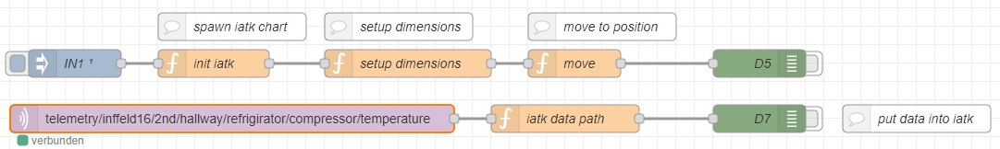

Init IATK:
```JavaScript
try {
    console.log("INIT IATK from NR ... 1");
    var nextId = Main_GetNextChartId();
    
    flow.set("mychart", nextId);
    
    console.log("INIT IATK from NR ... 2");
    var chartObj = RT.VIS.GetNewChartObjectIATK(
        nextId, 
        MAIN.usercanvas.charts.length,
        "IATKChart", 
        MAIN.usercanvas.canvasSize, 
        MAIN.usercanvas.canvasSpacedSize);
        
    console.log("INIT IATK from NR ... 3");
    MAIN.usercanvas.charts.push(chartObj);
    
    console.log("INIT IATK from NR ... 4");
    MAIN.RR.Runtime.ToggleObjManipulation(chartObj.chartGoName);
    
    console.log("INIT IATK from NR ... 5");
    msg.payload = nextId;
} catch(err) {
    var strmsg = "trying to run client side code ... => " + err;
    msg.payload = strmsg;
    node.warn(strmsg);
}
return msg;
```

Setup Dimesnion:
```JavaScript
//var chartId = flow.get("mychart");
var chart = null;
try {
    var chartId = msg.payload;
    chart = MAIN.usercanvas.charts[chartId];
    if (chart.rtds != null) {
        chart.rtds.AddDimension("temperature", 0, 100);
        for (var i = 0; i < 100; i++) {
            //chart.rtds.AddDataByStr("id", i);
            chart.rtds.SetDataStrVal("id", i);
        }
    }
    chart.abstractVisualisation.visualisationReference.yDimension.Attribute = "temperature";
    chart.abstractVisualisation.UpdateVisualisation(chart.PropertyType.Y);
    
    chart.abstractVisualisation.visualisationReference.zDimension.Attribute = "Undefined";
    chart.abstractVisualisation.UpdateVisualisation(chart.PropertyType.Z);
    
    chart.abstractVisualisation.visualisationReference.sizeDimension = "Undefined";
    chart.abstractVisualisation.UpdateVisualisation(chart.PropertyType.Size);
    
    var UE = importNamespace("UnityEngine");
    var gradient = new UE.Gradient();

    // Populate the color keys at the relative time 0 and 1 (0 and 100%)
    var colorKey = [new UE.GradientColorKey(), new UE.GradientColorKey()];
    colorKey[0].color = new UE.Color(1, 0, 0);
    colorKey[0].time = 0.0;
    colorKey[1].color = new UE.Color(0, 1, 0)
    colorKey[1].time = 1.0;

    // Populate the alpha  keys at relative time 0 and 1  (0 and 100%)
    var alphaKey = [new UE.GradientAlphaKey(), new UE.GradientAlphaKey()];
    alphaKey[0].alpha = 1.0;
    alphaKey[0].time = 0.0;
    alphaKey[1].alpha = 1.0;
    alphaKey[1].time = 1.0;
    gradient.SetKeys(colorKey, alphaKey);
    
    chart.abstractVisualisation.visualisationReference.colourDimension = "temperature";
    chart.abstractVisualisation.visualisationReference.dimensionColour = gradient;
    //chart.abstractVisualisation.UpdateVisualisation(chart.PropertyType.Colour);
    
    console.log("CNR => chart.vis.updateViewProperties => chart.PropertyType.LinkingDimension");
    chart.abstractVisualisation.visualisationReference.linkingDimension = "names";
    //chart.abstractVisualisation.UpdateVisualisation(chart.PropertyType.LinkingDimension);
    //chart.vis.updateViewProperties(chart.PropertyType.LinkingDimension);
    
    chart.fctChangeStyle(chart.GeometryType.Lines);
    
    
    chart.fctUpdateChart();
} catch(err) {
    node.warn("CNR (setup dimensions) ERROR (maybe trying to run client code?) => " + err);
    return msg;
}

return msg;
```

Move:
```JavaScript
try {
    var chartId = msg.payload;
    var chart = MAIN.usercanvas.charts[chartId];
    
    var hT = MAIN.camHookGo.transform.position;
    var hR = MAIN.camHookGo.transform.rotation;
    var T = [hT.x, hT.y, hT.z];
    var R = [hR.x, hR.y, hR.z, hR.w];
    RT.Unity.SetPose(chart.chartGo, T, R, null);
} catch (err) {
    console.log("ERROR (maybe trying to run client code?) => " + err);
}
return msg;
```

Add data:
```JavaScript
var data = JSON.parse(msg.payload);
var val = data.temperature;
var chartId = flow.get("mychart");

try {
    var chart = MAIN.usercanvas.charts[chartId];
    chart.rtds.SetDataStrVal("temperature", val);
    chart.fctUpdateChart();
} catch(err) {
    node.warn("CNR (iatk data path) ERROR (maybe trying to run client code?) => " + err);
}
return msg;
```

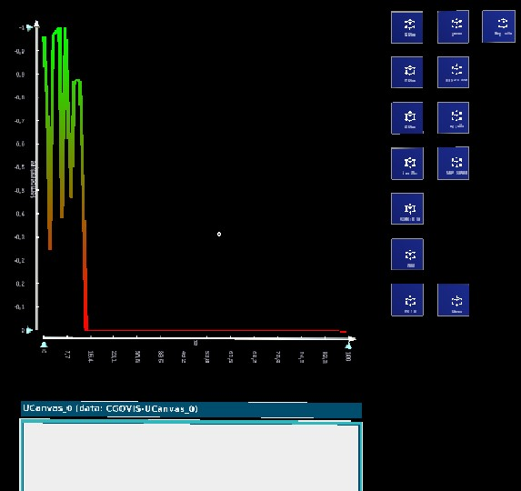
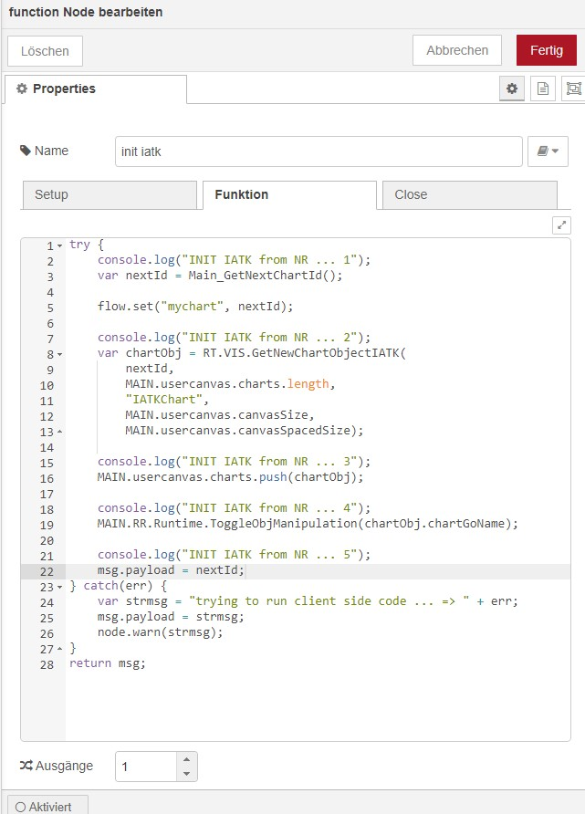
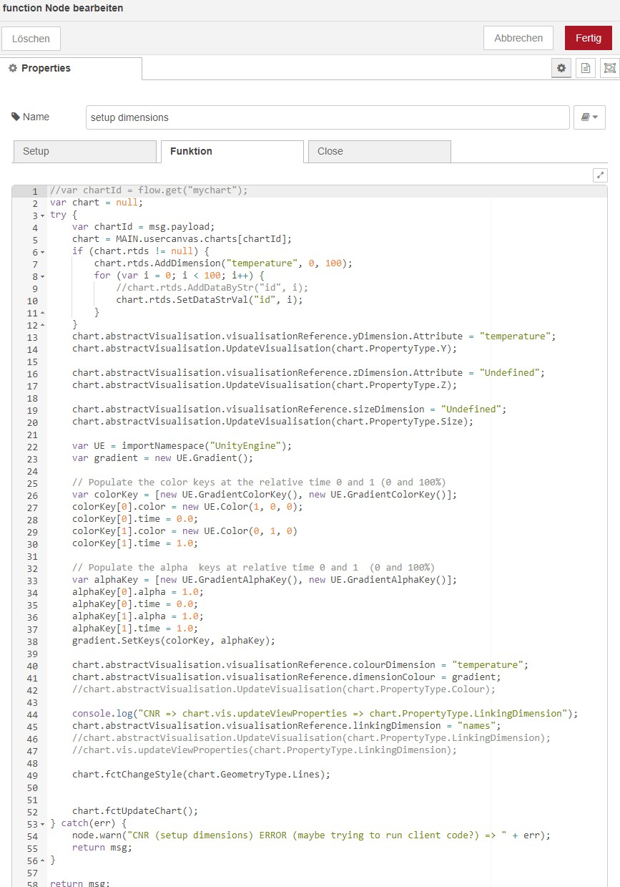
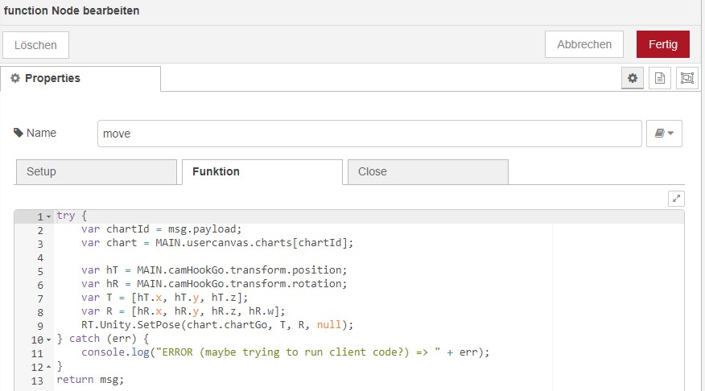


#### Notes and Open Tasks
 - [ ] Implement Callstack decoupling to reduces stacksize for bigger graphs.


## HowTos

### Setup MQTT
### Web Download

### Building a distance meter with CNR for the Hololens2 (AR Client)
In this example we show how to connect an Iot device (ultra sonic distance measure) to an visualization and showing it as Hud
in the Holololens. We assume that the our IoT device is already setup within the network and publishing its data.

To implement this be have we can split it into three steps:

1. Setup visualization
1. Move visualization into the HUD space
1. Connect Data to the visualization.

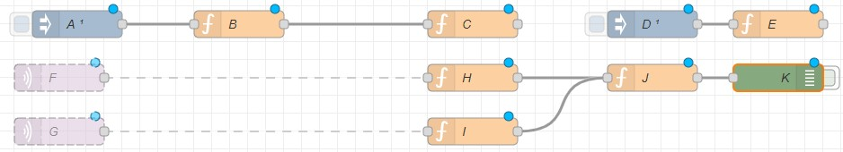

***A:*** Inject with an delay of 5 seconds to trigger the initialization.
***B:*** Holds the `JSON` configuration of our planned visualization and passed it on.
***C:*** Spawn the visualizaion, stores its `id` within the flow as `jsonchart` ands the dimensions to be visualized to the realtidatasource of the visualization object.
***D:*** Injects after 7 seconds to move the created visualization into the HUD mode.
***E:*** Moves the visualization.
***F+G:*** Conenct to the data serving MQTT topics.
***H+I:*** Parsed the data and set it as common payload to be interpreted by J.
***J:*** Puts the data from the MQTT Data Stream into the realtime datasource.
***K:*** Debug node which prints to terminal.

```js
// A
var visData = 
{
    "UID":"",
    "VisualisationType":"SCATTERPLOT",
    "parallelCoordinatesDimensionsAttributes":[],
    "parallelCoordinatesDimensionsMinFilter":[],
    "parallelCoordinatesDimensionsMaxFilter":[],
    "parallelCoordinatesDimensionsMinScale":[],
    "parallelCoordinatesDimensionsMaxScale":[],
    "Geometry":6,
    "AxiesKeys":[0,1],
    "AxiesValues":["id","distance"],
    "ColourDimension":"distance",
    "SizeDimension":"Undefined",
    "LinkingDimension":"Undefined",
    "colourKeys":
    {
        "serializedVersion":"2",
        "key0":{"r":0.0,"g":0.0,"b":1.0,"a":1.0},
        "key1":{"r":0.0,"g":1.0,"b":0.0,"a":1.0},
        "key2":{"r":0.0,"g":0.0,"b":0.0,"a":0.0},
        "key3":{"r":0.0,"g":0.0,"b":0.0,"a":0.0},
        "key4":{"r":0.0,"g":0.0,"b":0.0,"a":0.0},
        "key5":{"r":0.0,"g":0.0,"b":0.0,"a":0.0},
        "key6":{"r":0.0,"g":0.0,"b":0.0,"a":0.0},
        "key7":{"r":0.0,"g":0.0,"b":0.0,"a":0.0},
        "ctime0":0,"ctime1":65535,"ctime2":0,"ctime3":0,"ctime4":0,"ctime5":0,"ctime6":0,"ctime7":0,
        "atime0":0,"atime1":65535,"atime2":0,"atime3":0,"atime4":0,"atime5":0,"atime6":0,"atime7":0,
        "m_Mode":0,
        "m_NumColorKeys":2,
        "m_NumAlphaKeys":2
    },
    "colour":{"r":0.0,"g":0.0,"b":1.0,"a":0.5},
    "Size":0.3,
    "MinSize":0.01,
    "MaxSize":0.4,
    "VisualisationWidth":0.3,
    "VisualisationHeight":0.3,
    "VisualisationDepth":0.3
};
msg.payload = visData;
return msg;
```
```js
// C
try {
    console.log("INIT IATK from NR ... 1");
    var nextId = Main_GetNextChartId();
    
    flow.set("jsonchart", nextId);
    
    console.log("INIT IATK from NR ... 2");
    var chartObj = RT.VIS.GetNewChartObjectIATK2(
        nextId, 
        MAIN.usercanvas.charts.length,
        "IATKChart", 
        MAIN.usercanvas.canvasSize, 
        MAIN.usercanvas.canvasSpacedSize,
        false);

    MAIN.usercanvas.charts.push(chartObj);
    MAIN.RR.Runtime.ToggleObjManipulation(chartObj.chartGoName);

    chartObj.rtds.AddDimension("distance", 0, 100);
    chartObj.rtds.AddDimension("temperature", 0, 100);
        
    //apply json here
    var json = JSON.stringify(msg.payload);
    chartObj.vis.theVisualizationObject.creationConfiguration.DeserializeJson(json);
    
    //update from json
    importNamespace("IATK").Replicator.SyncVis(chartObj.vis);
    chart.fctUpdateChart();
    
    msg.payload = nextId;
} catch(err) {
    var strmsg = "trying to run client side code ... => " + err;
    msg.payload = strmsg;
    node.warn("init iatk2 => " + strmsg);
}
return msg;
```
```js
// E
var chartId = flow.get("jsonchart");
try {
    // Move the vis into HUD mode (Fixed to the Head movement)
    var chart = MAIN.usercanvas.charts[chartId];
    var hT = MAIN.camHookGo.transform.position;
    var hR = MAIN.camHookGo.transform.rotation;
    var T = [hT.x, hT.y, hT.z];
    var R = [hR.x, hR.y, hR.z, hR.w];
    RT.Unity.SetPose(chart.chartGo, T, R, null);
    RT.Unity.SetParent(chart.chartGo, MAIN.camHookGo);
    RT.Unity.SetLocalPose(chart.chartGo, [0,-0.1,0], null, null);
} catch(err) {
    node.warn("CNR (move2) ERROR (maybe trying to run client code?) => " + err);
}
return msg;
```
```js
// H
var data = JSON.parse(msg.payload);
msg.payload = data;
return msg;
```
```js
// I
var data = JSON.parse(msg.payload);
msg.payload = data.StatusSNS;
return msg;
```
```js
// J
// Read values
var data = msg.payload;
var temperature = data.BME280.Temperature;
var humidity = data.BME280.Humidity;
var distance = data.SR04.Distance;
var chartId = flow.get("jsonchart");

try {
    // apply to dimensions
    var chart = MAIN.usercanvas.charts[chartId];
    chart.rtds.SetDataStrVal("distance", distance);
    chart.rtds.SetDataStrVal("temperature", temperature);
    chart.fctUpdateChart();
} catch(err) {
    node.warn("CNR (J) ERROR (maybe trying to run client code?) => " + err);
}
return msg;
```

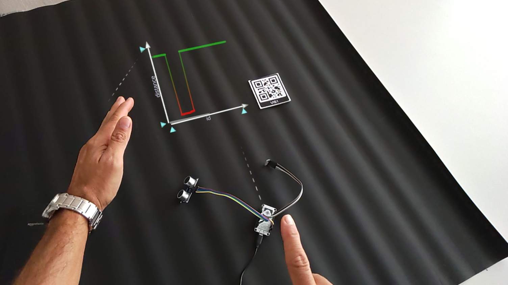
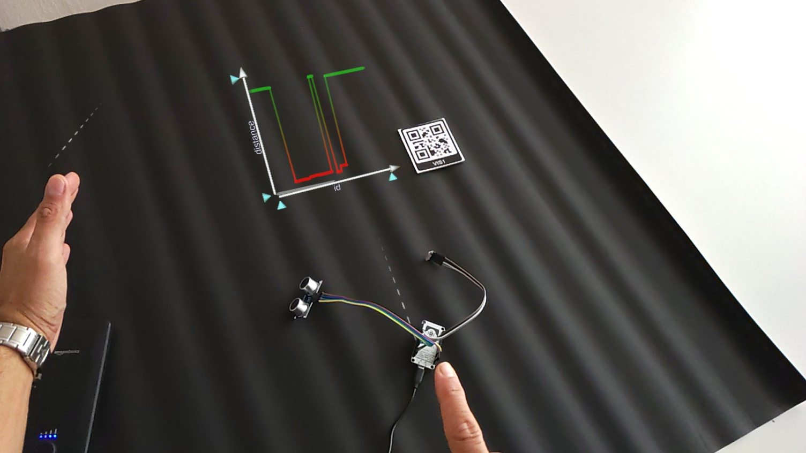

[Video Distance alone](https://files.icg.tugraz.at/f/cb86334cbebc4e0c801c/)
[Video Iot Fridge](https://files.icg.tugraz.at/f/136b50d42475419dbc41/)

#### Fridge Solution 1
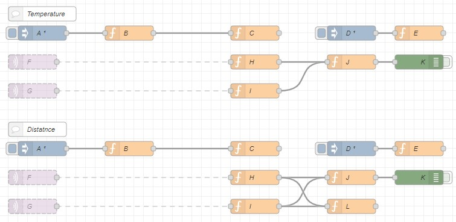

#### Fridge Solution 2
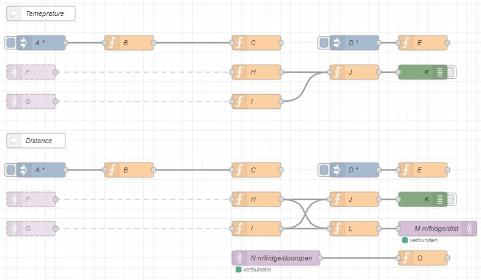

### MOPOP on CNR

#### MusicBrainz web-crawler into Postgres:
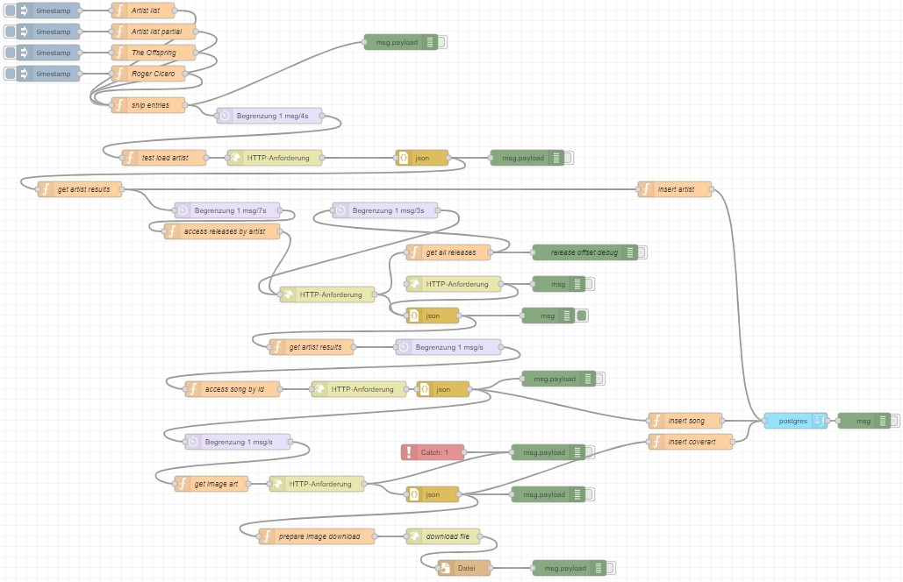

#### MQTT topics and SOng-API:
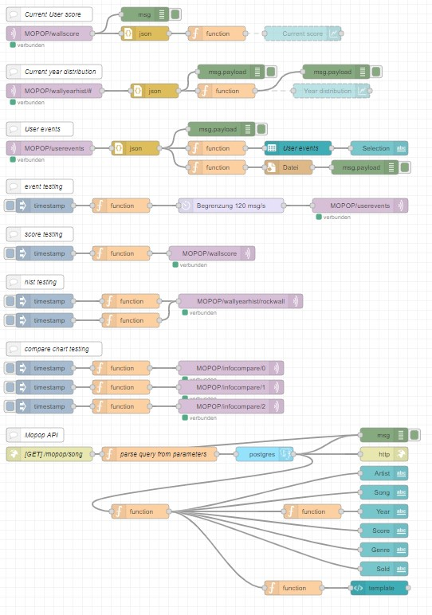

#### MOPOP over CNR (Lib + Autostarting):
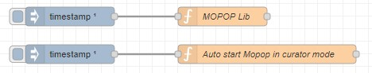

```js
//MOPOP Lib
...
// Addin to work with cnr: 
// expose to global namesapce
window.MOPOP = MOPOP;
window.MOPOP_InitEnv = MOPOP_InitEnv;
window.MOPOP_InitMqtt = MOPOP_InitMqtt;
window.scoreweight = scoreweight;
window.MOPOP_CalcScore = MOPOP_CalcScore;
window.MOPOP_UpdateHookOccupation2 = MOPOP_UpdateHookOccupation2;
window.MOPOP_UpdateHookOccupation = MOPOP_UpdateHookOccupation;
window.MOPOP_InitYearHist = MOPOP_InitYearHist;
window.MOPOP_InitInfoCompareChart =MOPOP_InitInfoCompareChart;
window.MOPOP_InitScoreChart = MOPOP_InitScoreChart;
window.MOPOP_SetupYearHist = MOPOP_SetupYearHist;
window.MOPOP_SetupTimeline = MOPOP_SetupTimeline;
window.MOPOP_SaveEnv =MOPOP_SaveEnv;
window.MAIN_CreateLabel = MAIN_CreateLabel;
window.MOPOP_GetYearFromString = MOPOP_GetYearFromString;
window.MOPOP_ImportAssets = MOPOP_ImportAssets;
window.MOPOP_AutoStart = MOPOP_AutoStart;
window.MOPOP_ReportUserEvent = MOPOP_ReportUserEvent;
window.MOPOP_ToggleWallManipulation =MOPOP_ToggleWallManipulation;
window.MOPOP_MenuShow = MOPOP_MenuShow;
window.MOPOP_MenuHide = MOPOP_MenuHide;
window.MOPOP_TestDB = MOPOP_TestDB;
window.MOPOP_AddAnchors = MOPOP_AddAnchors;
window.MOPOP_DownloadArtefact = MOPOP_DownloadArtefact;
window.MOPOP_InfotableClick = MOPOP_InfotableClick;
window.MOPOP_TempTable_StandardHookExit = MOPOP_TempTable_StandardHookExit;
window.MOPOP_TempTable_StandardHookEntry =MOPOP_TempTable_StandardHookEntry;
window.MOPOP_TempTable_InfoHookEntry =MOPOP_TempTable_InfoHookEntry;
window.MOPOP_SetupHookwall =MOPOP_SetupHookwall;
window.MOPOP_HookWallHookExit =MOPOP_HookWallHookExit;
window.MOPOP_HookWallHookEntry =MOPOP_HookWallHookEntry;
window.MOPOP_SetupScoreChart = MOPOP_SetupScoreChart;
...
```

```js
// Auto start Mopop in curator mode

node.warn("Auto starting MOPOP ...");
$("#rr_mopop_u_started").hide();
        var murl = MAIN.WEBAPI.uiurl + "/mopop/mopop-opening.jpg";
        $("#rr_mopop_u_started").html('');
        $("#rr_mopop_u_started").show();
        RT.Web.SetTiimeout(8000, function () {
            importNamespace("Vizario").AssetBundleHolder.ImportFromFile(
                MAIN.location.envassetbundle, MAIN.location.envassetbundle);
            MOPOP_AutoStart();
        });
return msg;
```

#### CouchDB location extension `mopop`
```json
{
  "_id": "ASUS_5G",
  "_rev": "41-4ff9cf66de467ac1814acf690173491a",
  "name": "ASUS_5G",
  "type": "location",
  "numwabatches": 0,
  "Xnumwabatches": 524,
  "waprefix": "ASUS_5G-WA-",
  "imagetargetenv": [
    "mopop_userstudy.xml",
    "mopop_userstudy.dat"
  ],
  "moreassets": [
    "sc.ab"
  ],
  "envassetbundle": "mopop.ab",
  "mopop": {
    "artefacts": {},
    "temptables": [
      {
        "name": "morespace",
        "displayname": "More Space",
        "width": 2,
        "height": 2,
        "tilemodel": "HookTile",
        "tilesize": 0.3,
        "transform": {
          "position": [
            3.804215908050537,
            1.294393539428711,
            -0.6822028160095215
          ],
          "rotation": [
            -0.002331048483029008,
            0.01442523393779993,
            0.7800447344779968,
            -0.6255531907081604
          ],
          "scale": [
            1,
            1,
            1
          ]
        }
      },
      {
        "name": "infotable",
        "displayname": "Infotable",
        "width": 1,
        "height": 1,
        "tilemodel": "HookTile",
        "tilesize": 0.3,
        "transform": {
          "position": [
            1.025374174118042,
            3.368659496307373,
            -0.3881990909576416
          ],
          "rotation": [
            -0.05886521935462952,
            0.08239154517650604,
            -0.6952781677246094,
            0.7115720510482788
          ],
          "scale": [
            1,
            1,
            1
          ]
        }
      },
      {
        "name": "scoretable",
        "displayname": "Your Score",
        "width": 1,
        "height": 1,
        "tilemodel": "HookTile",
        "tilesize": 0.3,
        "transform": {
          "position": [
            2.0035817623138428,
            0.4801814556121826,
            0.6356710195541382
          ],
          "rotation": [
            0.002711564302444458,
            0.003594011068344116,
            -0.9999783635139465,
            0.004803165793418884
          ],
          "scale": [
            1.5856419801712036,
            1.5856419801712036,
            1.5856419801712036
          ]
        }
      }
    ],
    "hookwalls": [
      {
        "name": "popwall",
        "reversed": false,
        "displayname": "Pop Culture",
        "genre": "pop",
        "width": 14,
        "height": 9,
        "tilemodel": "HookTile",
        "tilesize": 0.1,
        "timeline": {
          "start": 1990,
          "end": 2000,
          "tick": 1
        },
        "transform": {
          "position": [
            3.774080276489258,
            3.422813892364502,
            -0.33565711975097656
          ],
          "rotation": [
            0.49363914132118225,
            -0.481217622756958,
            -0.5240395069122314,
            0.5001325607299805
          ],
          "scale": [
            1.2606364488601685,
            1.2606364488601685,
            1.2606364488601685
          ]
        }
      },
      {
        "name": "rockwall",
        "reversed": true,
        "displayname": "Rock 'n' Roll",
        "genre": "rock",
        "width": 14,
        "height": 9,
        "tilemodel": "HookTile",
        "tilesize": 0.1,
        "timeline": {
          "start": 1990,
          "end": 2000,
          "tick": 1
        },
        "transform": {
          "position": [
            1.8760108947753906,
            2.0309338569641113,
            -0.40208590030670166
          ],
          "rotation": [
            0.4530954360961914,
            0.454956978559494,
            0.5400139093399048,
            0.5441539883613586
          ],
          "scale": [
            1.2262479066848755,
            1.2262479066848755,
            1.2262479066848755
          ]
        }
      }
    ]
  }
}
```
## Builds

- [ARClient rr_vu 1.2.108](https://files.icg.tugraz.at/f/d1af0989394d4f089b18/?dl=1)
- [ARClient rr_vu 1.2.224](https://files.icg.tugraz.at/f/ccd54365a08a4f089744/?dl=1)

## Test
[gimmick:yuml]([Customer]<>-orders*>[Order]++-0..*>[LineItem], [Order]-[note: Aggregate Root ala DDD{big:wheat}])
