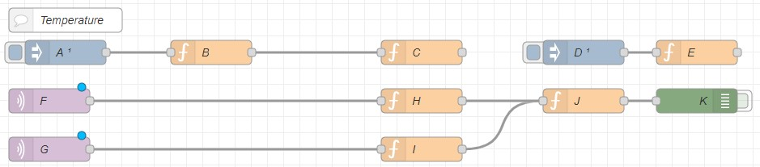
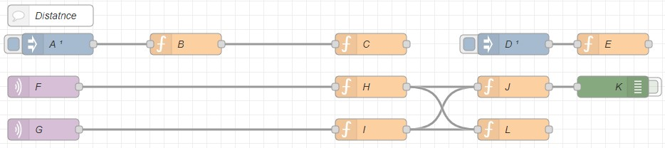
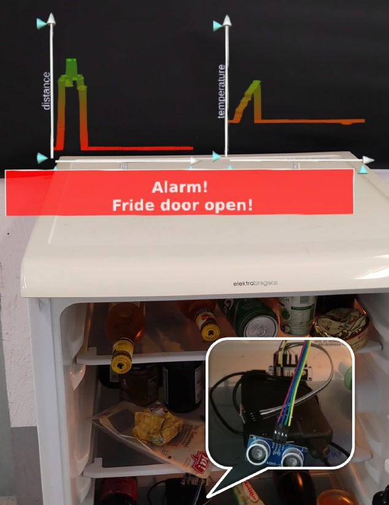

# Smart Fridge Tutorial

Consider the following scenario: The fridge door often remains open.
Therefore we would like to setup an alarm and to record the actual temperature drop.

To obtain real values in real-time we install one of our nodeMCU based (ESP8266) sensors equiped
with an temperature and and an ultrasonic distance sensor within the fridge. The distance sensor
points towards the door, allowing to easily detect owhen the door is open. Measurements below
35cm indicate a closed door and above an open door.

Within the Hololens we would like to see two line-based visualizations as time series

  - Temperature curve
    - X-Axis: running time series
    - Y-Axis: measured temperature
    - Z-Axis: disabled

  - Distance curve
    - X-Axis: running time series
    - Y-Axis: measured distance
    - Z-Axis: disabled
    
An alarm should be played one the door is opened and stopped when closed. Additionally a 
visual alarm should be visualized within he users field of view.

A setup of the backend and the initial setup of the Hololens ARClient can be found [here](setup.md).

In this walkthrough we will work without any location information and manually place the visualizations
close to the fridge. A separate tutorial will handle location and localization specific use cases.

## Creating a clientside flow

We can access NodeRed running within our backend (usually) on [http://localhost:1880](http://localhost:1880) and a new flow. The simplest form of loading 
the flow on th client is to download it via it Id, which can be taken from its url (eg `http://localhost:1880/#flow/f3784d00.40ef8` -> `f3784d00.40ef8`).

This id is later used as download link on button press. A different way to load a flow on the client is to define a fixed entrypoint for flows and to continue
loading from there.

### Lets begin with the temperature part



***First***, we add an `Inject` node `A` and set it up to fire ones after 5 seconds, `Function` node `B` holding the `JSON` configuration of our temperature visualization and 
another `function` node `C` initializing the visualization using our `JSON`-definition from `B`. The `JSON` format follows IATK's parameter convention ([IATK on Github](https://github.com/MaximeCordeil/IATK)
and [Phil's Fork](https://github.com/philfleck/IATK)).

```js
// B
var visData = 
{
    "UID":"",
    "VisualisationType":"SCATTERPLOT",
    "parallelCoordinatesDimensionsAttributes":[],
    "parallelCoordinatesDimensionsMinFilter":[],
    "parallelCoordinatesDimensionsMaxFilter":[],
    "parallelCoordinatesDimensionsMinScale":[],
    "parallelCoordinatesDimensionsMaxScale":[],
    "Geometry":4,
    "AxiesKeys":[0,1],
    "AxiesValues":["id","temperature"],
    "ColourDimension":"temperature",
    "SizeDimension":"Undefined",
    "LinkingDimension":"names",
    "colourKeys":
    {
        "serializedVersion":"2",
        "key0":{"r":1.0,"g":0.0,"b":0.0,"a":1.0},
        "key1":{"r":0.0,"g":1.0,"b":0.0,"a":0.5},
        "key2":{"r":0.0,"g":0.0,"b":0.0,"a":0.0},
        "key3":{"r":0.0,"g":0.0,"b":0.0,"a":0.0},
        "key4":{"r":0.0,"g":0.0,"b":0.0,"a":0.0},
        "key5":{"r":0.0,"g":0.0,"b":0.0,"a":0.0},
        "key6":{"r":0.0,"g":0.0,"b":0.0,"a":0.0},
        "key7":{"r":0.0,"g":0.0,"b":0.0,"a":0.0},
        "ctime0":0,"ctime1":65535,"ctime2":0,"ctime3":0,"ctime4":0,"ctime5":0,"ctime6":0,"ctime7":0,
        "atime0":0,"atime1":65535,"atime2":0,"atime3":0,"atime4":0,"atime5":0,"atime6":0,"atime7":0,
        "m_Mode":0,
        "m_NumColorKeys":2,
        "m_NumAlphaKeys":2
    },
    "colour":{"r":0.0,"g":0.0,"b":1.0,"a":0.5},
    "Size":0.2,
    "MinSize":0.04,
    "MaxSize":0.2,
    "VisualisationWidth":0.3,
    "VisualisationHeight":0.3,
    "VisualisationDepth":0.3
};
msg.payload = visData;
return msg;
```

```js
// C
try {
    console.log("INIT IATK from NR ... 1");
    var nextId = Main_GetNextChartId();
    
    flow.set("jsonchart", nextId);
    
    console.log("INIT IATK from NR ... 2");
    var chartObj = RT.VIS.GetNewChartObjectIATK2(
        nextId, 
        MAIN.usercanvas.charts.length,
        "IATKChart", 
        MAIN.usercanvas.canvasSize, 
        MAIN.usercanvas.canvasSpacedSize,
        false);

    MAIN.usercanvas.charts.push(chartObj);
    MAIN.RR.Runtime.ToggleObjManipulation(chartObj.chartGoName);

    //chartObj.rtds.AddDimension("distance", 0, 300);
    //chartObj.rtds.SetDataStrVal("distance", 250);
    
    chartObj.rtds.AddDimension("temperature", 0, 15);
    chartObj.rtds.SetDataStrVal("temperature", 7);
    chartObj.abstractVisualisation.UpdateVisualisation(chartObj.PropertyType.Y);
        
    //apply json here
    var json = JSON.stringify(msg.payload);
    chartObj.vis.theVisualizationObject.creationConfiguration.DeserializeJson(json);
    
    //update from json
    importNamespace("IATK").Replicator.SyncVis(chartObj.vis);
    chart.fctUpdateChart();
    chart.vis.updateProperties();
    
    msg.payload = nextId;
} catch(err) {
    var strmsg = "trying to run client side code ... => " + err;
    msg.payload = strmsg;
    node.warn("C => " + strmsg);
}
return msg;
```

Please note we have to work around some limitations/circumstances:

- A flow has to be deployed to be loadable by our AR Client
- A deploeyd flow will run automatically run on the server
- A flow can either be disabled or enabled
- We can also run a disabled flow on the ARCLient
- In cases the flow needs to run both ways or to deployed as enabled we can do the following o restrict control flow:
  - add `try-catch` blocks preventing  execution on the wrong host (eg node `C`)
  - add fitler nodes at any point to prevent message forwarding or to allow for empty messages or simulated payload
    - a filter can simply be implemented by checking the existance of some function, since the ARClient is simulating the backend, it is easier to check for known client function (see `client filter`)

```js
// cient filter
try {
    var n = MAIN.usercanvas;
    return msg;
} catch(err) {
    return null;
}
return null;
```

Functions like `RT.VIS.GetNewChartObjectIATK2` are implemented in the ARClients Runtime ([runtime.js](../runtime.js)) which is hotloaded from the backend
at startup (by default). The runtime provides helper functions for common tasks such as creating an empty visualization. By providing a higher level wrap
we can make IATK function easily accissible and referenceable without ommiting its default API, which still can be (and is) used to certain tasks. More helpful 
functions and an examplaratoy applicaiton implementaion can be found in [main.js](../main.js), which is also the playground for this example.

***Second***, we add an `inject` node `D` which triggers ones after 7 seconds and a `function` node `E` which setups the visualization spatially, for example by moving it
into the users HUD. In this cae we simply add an BoxCollider to allow tap-and-drag manipulation:

```js
// E
var chartId = flow.get("jsonchart");
try {
    var chart = MAIN.usercanvas.charts[chartId];
    
    //move in front of the user
    var hT = MAIN.camHookGo.transform.position;
    var hR = MAIN.camHookGo.transform.rotation;
    var T = [hT.x, hT.y, hT.z];
    var R = [hR.x, hR.y, hR.z, hR.w];
    RT.Unity.SetPose(chart.chartGo, T, R, null);
    
    //ad a boxcollider to allow manipulation
    var bc = MAIN.RR.Runtime.AddBoxCollider(chart.chartGo);
    bc.size = new MAIN.UE.Vector3(0.3, 0.3, 0.3);
} catch(err) {
    node.warn("CNR E ERROR (maybe trying to run client code?) => " + err);
}
return msg;
```

***Third***, we add nodes to access real-time data of the sensor and to feed the visualization. Nodes `F` and `G` listen on two different MQTT topics on which the sensor publishes 
(`telemetry/inffeld16/2nd/id2068/thermometer/this/SENSOR` and `telemetry/inffeld16/2nd/id2068/thermometer/this/STATUS8`) with differently formated payloads.

Node `H` parses the payload and forwards it:
```js
// H
var data = JSON.parse(msg.payload);
msg.payload = data;
return msg;
```

And node `I` parses the payload and additionally unwrapes one layer so that the outcome can be processed similarly to node `H`:
```js
// I
var data = JSON.parse(msg.payload);
msg.payload = data.StatusSNS;
return msg;
```
Node `J` passes the data to the visualization and node `K` creates console output:
```js
// J
//example payload
//"{"Time":"2021-08-17T07:31:36","BME280":{"Temperature":26.1,"Humidity":47.2,"DewPoint":14.0,"Pressure":973.8},"SR04":{"Distance":59.368},"PressureUnit":"hPa","TempUnit":"C"}"
var data = msg.payload;
var temperature = data.BME280.Temperature;
var humidity = data.BME280.Humidity;
var distance = data.SR04.Distance;
var chartId = flow.get("jsonchart");

try {
    var chart = MAIN.usercanvas.charts[chartId];
    //chart.rtds.SetDataStrVal("distance", distance);
    chart.rtds.SetDataStrVal("temperature", temperature);
    chart.fctUpdateChart();
} catch(err) {
    node.warn("CNR J ERROR (maybe trying to run client code?) => " + err);
}
return msg;
```

### Lets create the distance visualization and the alarm
The distance visualization is setup the same way as the temperature, but with a different Y dimension and an additional processing for the visualization part. To reduce the amount of message we could group together MQTT-IN nodes `F` and `G` from temperature and distance.



Node `L` takes the parsed payload and check the distance. If the distance is `>35cm` we play the alarm and show the notification otherwise we hide the notification:

```js
// L
var data = msg.payload;
var distance = data.SR04.Distance;
var falarm_old = flow.get("fridgealarm");
try {
    if(distance > 35) {
        PlayNotification();
        if(falarm_old == false) {
            flow.set("fridgealarm", true);
            msg.payload = true;
            RT.Unity.SpawnAlert(45, "Alarm!</br> Fridde door open!");
            return msg.payload;
        }
    } else {
        if(falarm_old == true) {
            flow.set("fridgealarm", false);
            msg.payload = false;
            var PUI = importNamespace("PowerUI");
            var wu = PUI.WorldUI.Find("WU_ALERT");
            if(wu != null) {
                wu.Expire();
            }
            return msg.payload;
        }
    }
} catch(err) {
    node.warn("CNR J ERROR (maybe trying to run client code?) => " + err);
}
return null;
```
## Setting up the client
Bevor launching the client application on the hololens we can add an button load the flow on the hololens, by adding it to [main.html](../main.html) / [main.js](js):

```js
// clientcode likely added inside main.js
var mopopCnrButton = RT.MRTK.SpawnButton("UIBTN-loadflow", "Load flow", "Load flow", false, 
  function () { CNR_InitFromId("923bd7d5.f34fa8"); });
MAIN.buttons.push(mopopCnrButton);
RT.Unity.SetParent(mopopCnrButton.go, MAIN.palmHandMenuGo);
RT.Unity.SetLocalPose(mopopCnrButton.go, [-0.04, 0.1, 0], null, null);
```

## Final result running on the client




