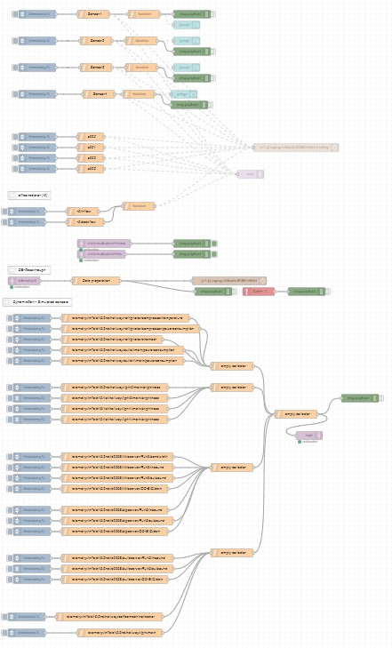
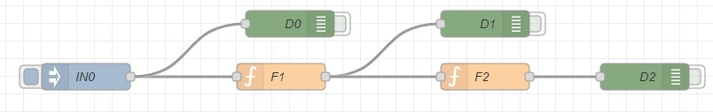
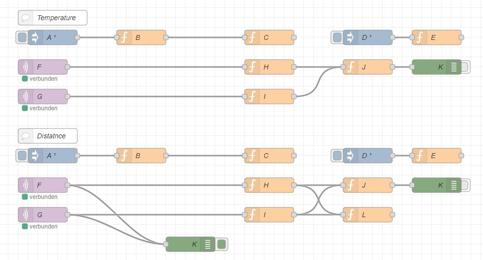
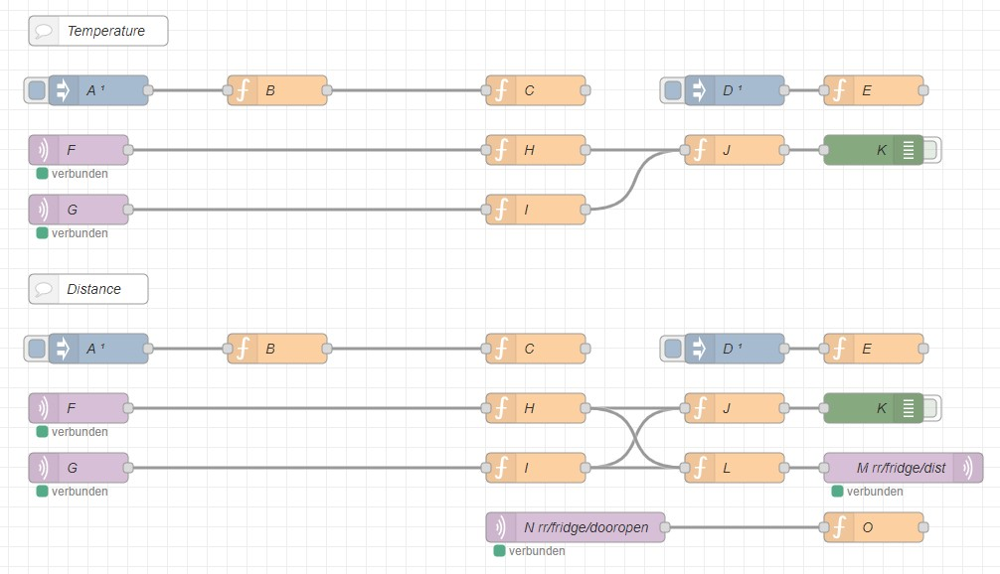
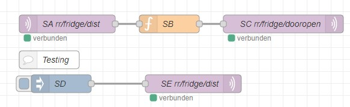
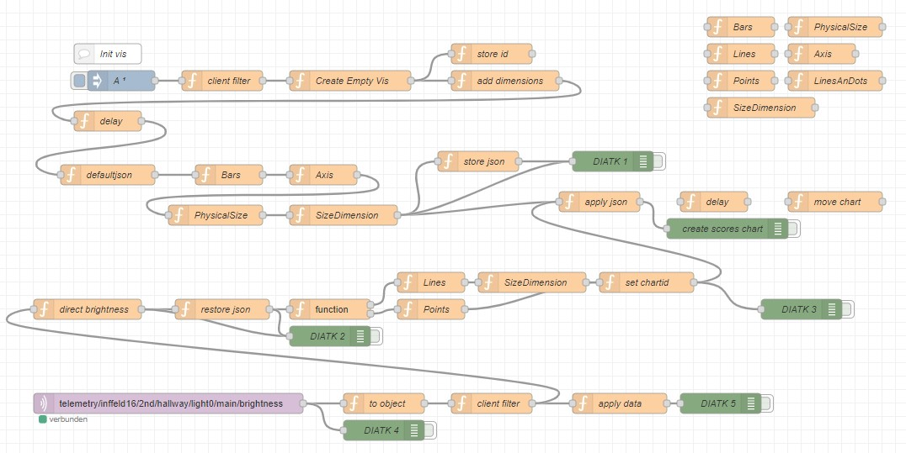
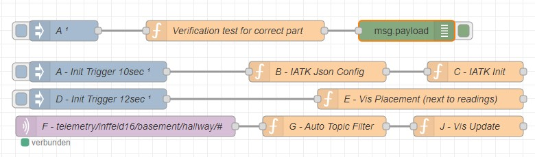
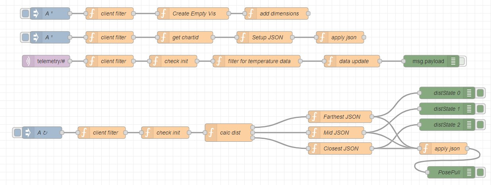

# Collection of Examples based on a Single NodeRed Flow

If not said different every example is meant to be run on the ARClient, therefore it can be deaktived on the hub. To be accessible from the ARClient, the flow has to b deployed.
Most of the examples already come with the default installation ([../backend/node-red/flows](../backend/node-red/flows)).

| Where | Example | Files | Image | Description |
| --- | --- | --- | --- | --- |
| Hub | Heating Data simulation | [heating_data_sim_hub.json](heating_data_sim_hub.json) |  | A number simple random value generator for a numer of topics to test any visualization without the need of real devices. Can be used to copy a real device/sensor 1:1 |
| Client | Simple Test | [simple_test.json](simple_test.json) |  | A simple function test creating output to the console or Unity.log |
| Client | Smart Fride | [smart_fridge.json](smart_fridge.json) |  | Smart fridge example from the paper. Visualizing Temperature, Distance and Alarm from the sensor. If you dont have the sensor, simply create within another flow fake date as done in [Heating](path to heating)|
| Client, Hub | Smart Fridge Distributed | [smart_fridge_distributed_client.json](smart_fridge_distributed_client.json) [smart_fridge_distributed_hub.json](smart_fridge_distributed_hub.json) |   | Distributed version on the Smart Fridgge example |
|todo|todo|todo|todo|todo|
|Client|Daisy IATK|[daisy_iatk.json](daisy_iatk.json)||Demonstrates on how to create flow based visualization configurations|
|Client|Basement generic device visualization|[basement_generic_device_part_vis.json](basement_generic_device_part_vis.json)||Shows how a generically define visualization can be applied to every part of every loaded device or referrent using auto-self initialization.|
|Client|All temperatures|[all_temperaures_proxemics.json](all_temperaures_proxemics.json)||In this example we gather all temperatures published to MQTT following a common topic-pattern and visualize them in a single Visualization by name. Furthermore, we use the users headpose to calculate the users distance to the visualizaion, which allows us demonstrate proxemics by switching level of detail.|

